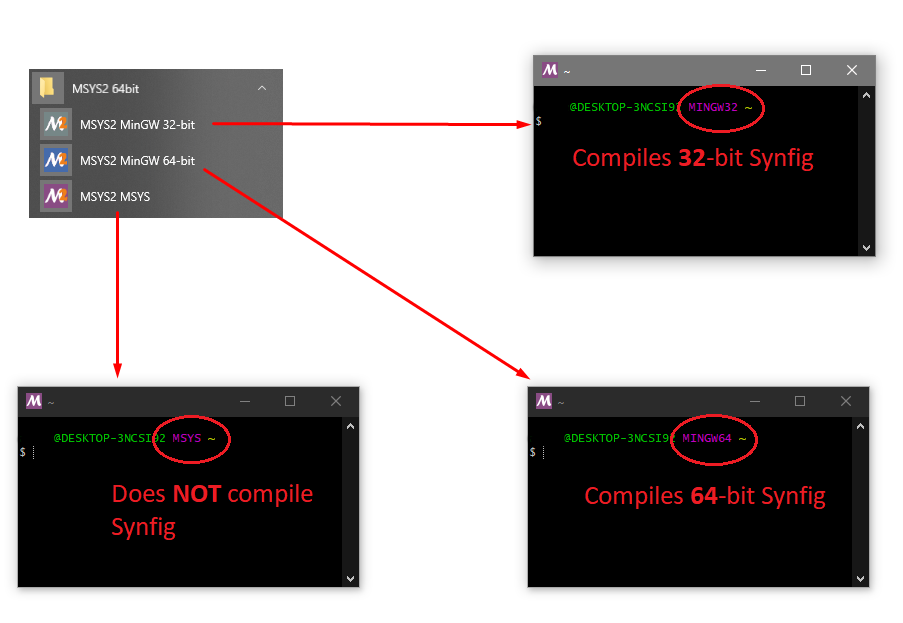

.. _Preparing Environment:

Preparing Environment
=====================

Building Synfig requires many dependent libraries installed for your system. For full list of libraries please refer to :ref:`this page <dependencies>`.

Below you will find instructions how to install them on various operating systems.

Linux
-------

First of all make sure you have "git" installed. Use it to fetch Synfig's sources:

.. code:: bash

    $ git clone https://github.com/synfig/synfig.git ~/synfig.git
    
Then navigate to sources directory:

.. code:: bash

    $ cd ~/synfig.git
    
Now you need to install all required dependencies. This is easy to do by running a special script shipped with Synfig's sources:

.. code:: bash

    $ ./1-setup-linux-native.sh

Wait till the script finish installing dependencies and you're ready to build.

OSX
-------

We will be running all commands in terminal, so start by launching Terminal app.

First you need to install Xcode Command Line Tools with the following command:

.. code:: bash

    $ xcode-select --install
    
Follow instructions on the screen to complete installation.

Next, get Synfig's sources:

.. code:: bash

    $ git clone https://github.com/synfig/synfig.git ~/synfig.git
    
When download finishes, navigate to sources directory:

.. code:: bash

    $ cd ~/synfig.git
    
Now we can install all required libraries via HomeBrew. There is a special script included with sources:

.. warning::
    It is NOT recommended to use this method on OSX version < 10.11 with already working Homebrew - with almost 100% probablility your Homebrew installation will be damaged. You've been warned.
    
    For more details about this issue see here - https://github.com/synfig/synfig/blob/678cc3a7b1208fcca18c8b54a29a20576c499927/1-setup-osx-brew.sh#L34-L37
    
.. code:: bash

    $ ./1-setup-osx-brew.sh
    
Depending on version of your system the process of installing dependencies might take some time. When it completes you are ready to build Synfig! 

.. note::  
    If you are having problems with slow download speed of brew packages, check to see if your ISP is blocking some IP addresses. For example, in Russia Roskomnadzor blocks some IP addresses (https://isitblockedinrussia.com/?host=54.192.98.189) used by the Homebrew CDN (they use Cloudfront servers). This leads to long connection timeouts. To fix this, you can restrict the `curl` connect-timeout parameter. This is how I fixed it:

.. code:: bash

    $ echo "--connect-timeout 1" >> ~/.curlrc
    $ export HOMEBREW_CURLRC=1

P.S. Quick hack if you certificates outdated, and brew can't download packages:

.. code:: bash

    $ echo "--insecure" >> ~/.curlrc
    $ export HOMEBREW_CURLRC=1

Windows
-------

.. note::
    For compiling Synfig on Windows we use MinGW installation in MSYS2 environment.
    
    Alternative for that approach could be to build using MSVC and Microsoft vcpkg (https://github.com/microsoft/vcpkg), but we haven't digged into that yet. Any help on this matter is appreciated here - https://github.com/synfig/synfig/issues/860.

Download and install MSYS2, following instructions here - https://www.msys2.org/.

Make sure to select the correct MSYS as per your needs.

Keep "Run MSYS2 64bit now." check, we will do a first update after the install with the following instruction.

.. code:: bash

    $ pacman -Syu
    
The shell will then close by itself and open the proper shell as described in the following image.

Always use the proper shell:

    * **MinGW32** for compiling **32**-bit Synfig.
    * **MinGW64** for compiling **64**-bit Synfig.
    * **Never** use the **MSYS** shell for compiling Synfig.

After picking the needed MSYS Shell (MinGW64 for most users), install the last updates (once again) and git.

.. code:: bash
    
    $ pacman -Syu
    $ pacman -S git

Next, get Synfig's sources:

.. code:: bash

    $ git clone https://github.com/synfig/synfig.git ~/synfig.git
    
When download finishes, navigate to sources directory:

.. code:: bash

    $ cd ~/synfig.git

Now you need to install all required dependencies. Run a special script shipped with Synfig's sources:

.. code:: bash

    $ ./1-setup-windows-msys2.sh

Wait till the script finish installing dependencies.
When it completes you are ready to build Synfig! 

.. note::
    The tools and libraries are architecture dependant, as will be the produced binaries.
    
    You will have to execute again `./1-setup-windows-msys2.sh` from the 'MinGW32' shell if you want to be able to build Synfig for this target.
    
    Generally, for development, you only need to use the shell corresponding to your own architecture.
    
