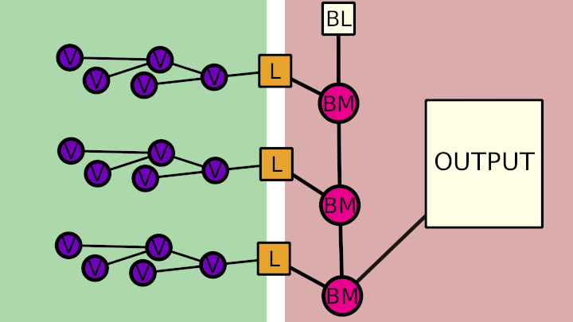
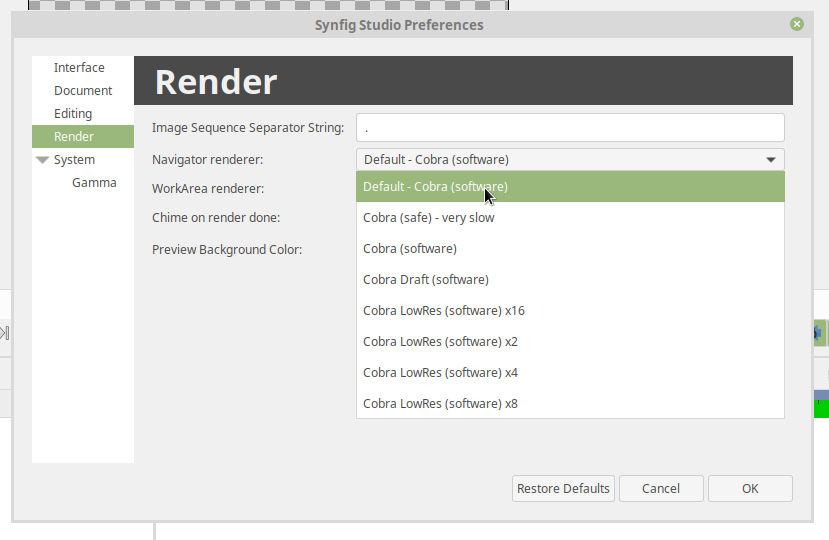

.. _structure:

Code structure
===============


Overview
--------

Synfig is divided into three components: ETL, synfig-core and synfig-studio.

* **ETL** is a template library that implements reference counting, portable threading and other low-level stuff. Every part of the Synfig project uses ETL in some way. It is like the C++ STL.
* **synfig-core** is Synfig's backend. It renders scenes and knows how to read and write Synfig XML files. This directory contains the Synfig library and the Synfig command-line tool. 
* **synfig-studio** is the graphical editor. It uses the GTK+ widget library. If you want to hack on the interface, this is what you should look at.

The structure of **synfig-core** is:

* ``synfig-core/src/synfig/`` - Code of **"libsynfig"** library. This is actually the main part of synfig-core. It contains code of render engine and routines for reading/writing Synfig's files. The **libsynfig** library is used by all other Synfig's components.
* ``synfig-core/src/modules/`` - Functionality of **libsynfig** can be extended with modules and this directory is a place for them. A module can do following things:
   * Add support for importing specific file format(s). Examples:
      * ``synfig-core/src/modules/mod_png/mptr_png.cpp``
      * ``synfig-core/src/modules/mod_bmp/mptr_bmp.cpp``
   * Add support for exporting (rendering) to specific file format(s). Examples:
      * ``synfig-core/src/modules/mod_png/trgt_png.cpp``
      * ``synfig-core/src/modules/mod_gif/trgt_gif.cpp``
   * Implement a layer type(s). Examples:
      *  ``synfig-core/src/modules/mod_geometry/circle.cpp`` - Circle Layer
      *  ``synfig-core/src/modules/lyr_freetype/lyr_freetype.cpp`` - Text Layer
      *  ``synfig-core/src/modules/mod_noise/distort.cpp`` - Noise Distort Layer	 
   * Implement a **valuenode** (see below on valuenodes). Example:
      * ``synfig-core/src/modules/mod_noise/valuenode_random.cpp``
* ``synfig-core/src/tool/`` - Code of synfig command-line tool (binary is simply called ``synfig``). It uses **libsynfig** to read Synfig files and render them in any supported format.

Main components of **synfig-studio**:

- ``synfig-studio/src/synfigapp/`` - Code of **libsynfigapp** library. This is a layer between GUI and **libsynfig** (from synfig-core). It contains code for **actions** - operations that transform loaded Synfig's file in some way. When user makes some change to Synfig file in GUI, then an *action* is called that does the actual modification.
- ``synfig-studio/src/gui/`` - Code of GUI written in GTKmm. This defines how application looks and behave.


So, we have following structure:

::

  gui ---> libsynfigapp -------> libsynfig
  
             synfig-cli -------> libsynfig


synfig-core
------------

Layers
~~~~~~

The basic building block in Synfig is **Layer**.

.. note::

   ``synfig-core/src/synfig/layer.cpp``

Layer either displays some graphical information on the screen (circle, line, text, etc.) or does some transformation of graphic information *under* it - i.e. acts as **filter** (blur, translation, noise distortion, etc.).

.. note::

   Built-in layers:
     - ``synfig-core/src/synfig/layers/``
   
   Layers as modules: 
     - ``synfig-core/src/modules/lyr_std``
     - ``synfig-core/src/modules/lyr_freetype``
     - ``synfig-core/src/modules/mod_example``
     - ``synfig-core/src/modules/mod_geometry``
     - ``synfig-core/src/modules/mod_gradient``
     - ``synfig-core/src/modules/mod_noise``
     - ``synfig-core/src/modules/mod_particle``
     

Layers are placed in particular order. 

::

  - Layer 3
  - Layer 2
  - Layer 1

Layers are rendered from bottom to top.

Context and Blend Methods
~~~~~~~~~~~~~~~~~~~~~~~~~

All graphics information under particular layer is called its **Context**.

In example above ``Layer 2`` together with ``Layer 1`` are context of ``Layer 3``.

If ``Layer 3`` is a graphic layer, then it displays some graphic information, which is composed with its context (``Layer 1`` and ``Layer 2``). The way how ``Layer 3`` composed with its context is defined by layer's **Blend Method**.

.. note::

   ``synfig-core/src/synfig/color/``
   
   TODO: Add link to list of available blend methods

If ``Layer 3`` is a filter layer, then it transforms graphic information created by ``Layer 1`` and ``Layer 2``.

Canvas
~~~~~~

A structure which stores a list of layers is called **Canvas**.

.. note::

   ``synfig-core/src/synfig/canvas.cpp``

A canvas can also store other canvases. This is how layers organized into hierarchy.

In GUI canvases represented by Groups, but in code they are called Paste Canvases. Paste Canvas is a special type of layers, which holds Canvas of other layers.

.. note::

   ``synfig-core/src/synfig/layers/layer_pastecanvas.cpp``

Every Synfig file has a Root Canvas, which contains all layers. Also it can have several *Exported* canvases - a separate canvases that are outside of Root Canvas.

Paste Canvas can be **inline** (i.e. include all its content in itself) or **linked** (i.e. reference content from exported canvases or other Synfig files).

.. note::

   Loading Synfig file:  ``synfig-core/src/synfig/loadcanvas.cpp``
   
   Saving Synfig file: ``synfig-core/src/synfig/savecanvas.cpp``

ValueNodes
~~~~~~~~~~

Every layer has a set of **Parameters**, which define how layer is rendered (and *what* it is rendering).

In simplest case layer parameter can be defined by a value of particular type - **ValueBase** (Integer, Real, Bool, Color, etc).

.. note::

   ``synfig-core/src/synfig/base_types.cpp``
   
In complex case parameter can be defined by **ValueNode**. ValueNode is a formula that produces a value from some calculations. Each ValueNode has parameters that define input data for formula. Parameters of ValueNode can also be represented by ValueBases (static value) or ValueNodes (calculated value), so it is possible to construct nested formulas.

.. note::

   ``synfig-core/src/synfig/valuenodes/``
   
   ``synfig-core/src/modules/mod_noise/valuenode_random.cpp``

It is possible to link ValueNodes and ValueBases among different parameters (and among different layers).

I.e. for two circle layers A and B we can link their Radius parameters (both static values, ValueBase). In this case, changing radius of one circle will change radius of another (see https://wiki.synfig.org/Doc:Getting_Started#Linking).

In more complex case we can have Radius parameter of circle A defined by Scale ValueNode. The Scale ValueNode have two parameters - "Link" and "Scalar". If "scalar" parameter is set to static value 2.0 and "Link" parameter is linked to "Radius" value of circle B, then circle A will always have a radius twice bigger than circle B. 

TODO: Make an illustration of layers sharing same ValueNodes/ValueBases

Among all different ValueNodes there is a special ValueNode, which deserves a special attention - it is called "Animated".

.. note::

   ``synfig-core/src/synfig/valuenodes/valuenode_animated.cpp``
   
   ``synfig-core/src/synfig/valuenodes/valuenode_animated.h``
   
   ``synfig-core/src/synfig/valuenodes/valuenode_animatedinterface.cpp``
   
   ``synfig-core/src/synfig/valuenodes/valuenode_animatedinterface.h``

This ValueNode stores multiple values of parameter for different moments of time and calculates interpolated values between them.

Rendering process
~~~~~~~~~~~~~~~~~

When Synfig needs to render a frame it starts by evaluating parameters of layers. If a parameter is ValueNode (calculated value), then it evaluates its parameters. This process works recursively, going all the way down to the leaf nodes, calculating their value, then calculating the value of their parent, and so on until reaching the root of the node tree.

Since ValueNodes can be animated (meaning that they can change value at different points of time), so the entire tree needs to be evaluated on each frame.

Once a layer has the values for it's parameters, it *renders* the intended shape or effect onto a raster. A raster is an array of pixels, each pixel with its color/opacity. It doesn't carry any information about the vector shapes that it's representing, only their pixel data.

Then comes blending. The raster result of the previous layers is combined with the current one according to the set blending method. Some layers (transforms, distortions, etc) just modify the raster result of the previous layers and pass that on to the next layer, instead of blending.

Note that a layer sees all the layers underneath as a single combined raster. That layer cannot distinguish the pixel data that comes from the next layer that's underneath, from pixel data from any other layer that's underneath.



On diagram: "V" stands for ValueNodes, "L" for layers, "BL" for blank layer (completely transparent layer default background), "BM" for blend method. 

Render engine
~~~~~~~~~~~~~

Now, let's talk about render engines.

In fact there are two of them now.

The new one (called "Cobra") is the our latest development and it is the future of Synfig.

And there is an old one (without a name). As of version 1.2.0 it is deactivated. But some layers are still use its code, in case if they are not ported to Cobra yet (Synfig fallbacks to old render engine). This generally works much slower comparing to case when layer's code is ported to Cobra.

If you examine code of any layer, you will see a function called ``accelerated_render()`` - this is a code of old render engine.

**Old rendering engine** examines stack of layers in two passes. 

First, it is going from top to bottom and applies required transformations (when possible). Also, it defines required context for rendering each layer. On second pass it goes from bottom to top. It is doing actual rendering for each layer and mixing it according to Blend Method with previous layers (context).

I.e., if we have Stretch Layer on top of Shape Layer, then on first pass Synfig goes down and applies stretch to all vertices of Shape Layer, thus eliminating Stretch from operations. Then on rendering stage it renders Shape Layer only (as stretch is already applied on first pass).


On the other hand, if we have Blur Layer between Stretch Layer and Shape Layer, then it is not possible to apply Stretch (because Blur is a raster-based effect). So it doesn't eliminates Stretch on first pass. On second pass it renders all 3 layers - Shape, then blurs it and finally stretches result.

Now, let's talk about **Cobra engine**, which is more advanced.

.. note::

   The code of Cobra render engine is located in ``/synfig-core/src/synfig/rendering``

Its main concepts are: *Task, Queue, Optimizer, Sub-Engine* and *Renderer*.

**Task** is the main primitive of Cobra render engine that does something. This is like Layer in Synfig's concept, but even more simple/low-level. I.e. there is a task for blending, task for drawing filled region, task for affine transformation, etc. 

For example, Outline and Region Layers are executed by the same task - the one that drawing filled region (Task Contour).

.. note::

  ``synfig-core/src/synfig/rendering/common/task/``
  
  ``synfig-core/src/synfig/rendering/software/task/``
  
  ``synfig-core/src/synfig/rendering/opengl/task/``

So, why we need both Tasks and Layers? How do both concepts relate to each other? Layers are good for user (they help to construct and organize animation document) and Tasks are good for render engine (they are not good for editing, but allow to render animation document as fast as possible). Tasks describe user's animation document in a low-level form, in a language that is suitable for render engine.

In a very simple view Cobra render engine also works in two passes. In first pass it takes a tree of Layers, and constructs a **Queue** of Tasks. In second pass it executes tasks in Queue (does rendering).

.. note::

  ``synfig-core/src/synfig/rendering/renderqueue.cpp``

Queue is a linear list, but Tasks can have dependencies. I.e. task A can depend on task B and C. That means when render engine processes Queue, it skips task A unless tasks B and C are ready. The task A is executed in next pass, after B and C are done. This allows to organize parallel (multi-threaded) rendering.

When Cobra does its first pass (transforms Layers to Queue of Tasks) it applies **Optimizers**.

Optimizers are analyzing list of tasks and re-organizing it to speedup rendering process.

.. note::

  ``synfig-core/src/synfig/rendering/common/optimizer/``


For example, there is an optimizer that looks for a sequences of Region/Outline Layers which could be merged into one task and thus rendered in single pass (without intermediate blending functions).

Now let's get to **Sub-Engines**.

It is clear there is a possibility to implement one particular task in different ways. For example, we can draw a vector region using straight-forward CPU calculations (software method), or activate OpenGL and use its functions to draw the same shape using videocard (hardware-accelerated).

In the same fashion, we can do Gaussian blur operation with straight-forward CPU calculations, or utilize hardware-accelerated methods.

So, all tasks are grouped by implementation method, forming a Sub-Engines.

Currently we have 2 sub-engines - "software" (the main one, all tasks done with calculations on CPU) and "OpenGL" (all tasks are hardware-accelerated using OpenGL, it is currently broken).

* Software Sub-Engine - ```synfig-core/src/synfig/rendering/software/```
* Tasks of Software Sub-Engine - ```synfig-core/src/synfig/rendering/software/task/```
* OpenGL Sub-Engine - ```synfig-core/src/synfig/rendering/opengl/```
* Tasks of OpenGL Sub-Engine - ```synfig-core/src/synfig/rendering/opengl/task/``

Generally, it is possible one Sub-Engine can use tasks from other Sub-Engine. I.e., when OpenGL Sub-Engine is active and there is some task missing, then it can be replaced by task from Software Sub-Engine.

Each Sub-Engine can have several configurations with different set of Optimizers. We call those configurations **Renderers** - and this is what user actually see when choosing renderer via "Edit" -> "Preferences..." -> "Render".



For example, "Draft" and "LowRes" rendering modes are just Renderers of Software Sub-Engine.

.. note::

  - Default Software Renderer - ``synfig-core/src/synfig/rendering/software/renderersw.cpp``
  - Safe-mode Software Renderer (not uses Optimizers) - ``synfig-core/src/synfig/rendering/software/renderersafe.cpp``
  - Draft Software Renderer - ``synfig-core/src/synfig/rendering/software/rendererdraftsw.cpp``
  - LowRes Software Renderer - ``synfig-core/src/synfig/rendering/software/rendererlowressw.cpp``


Now, let's get back to Layers.

We already know how Layers define their rendering for old render engine. But how this done for Cobra render engine?

If layer is ported to Cobra engine, then  you will see ``build_rendering_task_vfunc()`` or ``build_composite_task_vfunc()`` or ``build_composite_fork_task_vfunc()`` functions. So, in Cobra engine layers just use tasks as building blocks to construct structures which produce required output.

..
	synfigapp
	---------
	
	**main**
	
	../synfigapp/main - stores information for the entire application (fg/bg colors, width, settings, input devices)
	 
	../synfigapp/instance - information unique for each instance (root canvas, canvas interface list, selection manager, save/save_as)
	 
	../synfigapp/canvas_interface - information unique to each exported canvas (I believe opening a canvas in the canvas browser loads a new interface, but not a new instance)
	;* current time (at playhead), editing mode (normal/animated)
	;* wrappers for various actions, such as adding layers or adding/setting/converting valuenodes
	 
	../synfigapp/value_desc - link to a value node (eg. layer.param_name parent_value_node.param_index; animated.waypoint; canvas.param)
	valuelink - (?) Valuebase link. Inherits from synfig-core, why is this in studio/gtkmm?
	 
	../synfigapp/inputdevice - input devices
	../synfigapp/settings - settings
	../synfigapp/selectionmanager (look-into) - selection manager interface, null selection manager
	../synfigapp/editmode - edit mode (normal, animated)
	../synfigapp/uimanager - interface class for a UI interface (Dialogs such as yes_no, yes_no_cancel, etc) The actual UI interface used is defined elsewhere
	
	**action system**
	
	../synfigapp/action - defines types of actions: action, undoable, canvasspecific, super, group
	../synfigapp/action_param - defines parameters for action
	../synfigapp/action_system - action system and passive grouper
	../synfigapp/actions/* - individual action

	**misc**

	../synfigapp/general.h, general.h - gettext macros
	../synfigapp/cvs - cvs system
	../synfigapp/timegather - (?)

	gui
	---------

	[Core UI]
	main - entry point, creates an instance of App
	app - initializes the application (loads all UI components)
	;* manages instances (which one is selected), canvas views, preferences
	autorecover - automatic recovery (references app, uses instance)
	devicetracker: save/load preferences and init extended input devices
	instance - (?) inherits from synfigapp::Instance
	 
	[Misc UI]
	splash - splash screen window
	about - about dialog
	adjust_window - (?) Adjustment Window, uses scale factor
	onemoment - window saying "one moment, please"
	dialog_setup
	widget_filename
	iconcontroller - pairs icon files with gtk names. Can get an icon for a valuenode or layer
	 
	[Canvas view]
	canvasview - makes the menus; receives on_duck_changed events; creates a workarea
	 
	framedial - a table with play/forward/backward buttons
	keyframedial - buttons for seek next, previous, lock
	resolutiondial - Increase/decrease/ use low res
	toggleducksdial - Show/hide various types of ducks
	zoomdial - zoom in/out/etc
	 
	[================== Ducks and Tools =================]
	 
	[Workarea]
	workarea - [inherits from duckmatic and Gtk::Table] the workarea
	event_layerclick - event for layer clicked
	event_mouse - stores the mouse button pressed and any modifier keys
	eventkey - key of events (e.g. refresh, stop, undo, workarea clicked...)
	 
	[Ducks]
	duckmatic - manages ducks, ducks_dragger, strokes, and Beziers
	;* (Also defines duckdrag_base and translate)
	;* When a duck drag is done, passes the new locations of the duck to canvasview (reverse manipulation function)
	 
	duck - a duck (stores either a point or an angle of rotation)
	ducktransform_* - define duck transformations. These are used to transform the ducks so they line up with a transformed object on-screen
	 
	[Toolbox]
	toolbox.h - the toolbox
	widget_defaults - the fill/outline/etc selection widget in the toolbox
	widget_tooloptions
	 
	[State system]
	smach.h - typedef etl::smach<CanvasView,EventKey> Smach; // [state machine]
	statemanager -keep track of states
	state_* - all of the states
	;* states such as normal and rotate define their own duck draggers
	../synfigapp/blineconvert - used by draw tool to convert list of points to a bline
	 
	[================ Docks and Dialogs =================]
	[Docks System]
	dockmanager - gets size, position, or contents of a dockable, registers/unregisters dockables, find dockable or DockDialog, present a given dockable (takes a name)
	 
	dockable - generic class for dockables. "dnd" is "drag-and-drop"
	dockbook - a notebook (tabbed group) of docks
	dockdialog - a window, presumably  containing various dockbooks (tabbed groups) of dockables
	dock_canvasspecific - base class for canvas-specific dockables
	 
	[Docks]
	dock_info - (shows mouse position and the color under it)
	dock_navigator
	dock_history
	 
	dock_curves - uses curves widget + some time sliders
	widget_curves
	 
	[Tree docks]
	canvastreestore- (?)
	 
	dock_canvases - canvas browser
	 
	dock_timetrack
	widget_timeslider - the time track, labeled at regular intervals
	dialog_keyframe
	dialog_waypoint
	widget_keyframe_list
	widget_waypoint
	widget_waypointmodel
	keyframeactionmanager - "Add new keyframe" and "keyframe properties" buttons, keeps track of keyframe tree
	keyframetree - TreeView of keyframes
	keyframetreestore - stores keyframes (is there any point to keyframe_tree_store_class_?)
	 
	dock_metadata
	metadatatreestore - model for metadata tree
	 
	dock_layergroups
	layergrouptree - TreeView of layer groups
	layergrouptreestore - model for layer group tree
	 
	dock_children
	childrentree - TreeView of canvas' children
	childrentreestore - model for children tree
	 
	dock_layers
	dock_params
	layerparamtreestore - model for layer params tree
	layertreestore - model for layers tree
	layertree - returns TreeViews of layers and params
	layeractionmanager - keeps track of layer tree; creates actions relating to layers
	 
	[Widgets for valuenodes]
	widget_value - picks the right widget for a valuenode
	 
	widget_canvaschooser - Canvas valuenode (select canvas)
	widget_color
	widget_coloredit
	widget_gradient - gradient valuenode
	widget_compselect - select the composition (file) being edited
	widget_distance - spinbutton (for type real when it's a distance)
	widget_enum - enum type values
	widget_time - time valuenode
	widget_vector - (aka point)
	 
	[Dialogs]
	dialog_color - select a color
	dialog_gradient -set a gradient
	canvasoptions -toggles grid snapping, visibility, and size
	canvasproperties - name, id, info, and metadata
	 
	[======================= Other ======================]
	 
	[Renderer system] - I have not looked into this much
	asyncrenderer
	preview - Preview class and the preview widget
	renddesc - RendDesc widget (Render menu - why is it called desc?)
	renderer_* - rendering system
	workarearenderer
	dialog_preview
	dialog_targetparam - parameters for rendering target
	 
	[Audio system] - Did not look at, as it is disabled
	audiocontainer
	dialog_soundselect
	widget_sound
	 
	[Modules]
	./mod_mirror/ - Mirror tool
	./mod_palette/ - Palette
	module - interface class for models: has methods start() stop()
	 
	[======================= MISC =======================]
	 
	ipc - (?)
	keymapsettings - (Defines the structures for managing key map settings) affects accelerators
	 
	groupactionmanager - (look-into) references LayerGroupTree
	 
	compview - Does not appear to be used anywhere
