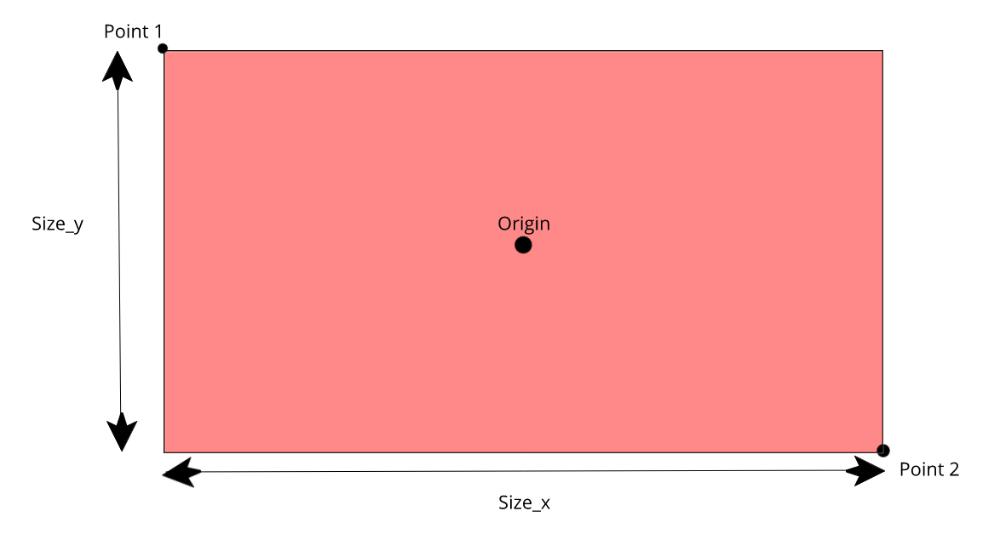

Rectangle Layer
===============

Table of Mappings
-------------------

+---------------------+---------------------------------------------------------------------------+
|       Property      |                         Path to Property in lottie                        |
+=====================+===========================================================================+
|       Z depth       |               Depends on ordering of layers in lottie format              |
+---------------------+---------------------------------------------------------------------------+
|        Amount       | shapes/fill.json -> “o” -> properties/[value.json OR valueKeyframed.json] |
+---------------------+---------------------------------------------------------------------------+
|     Blend_method    |            layers/shape.json -> “bm” -> helpers/blendMode.json            |
+---------------------+---------------------------------------------------------------------------+
|        Color        |                      shapes/fill.json -> “ty” = “fl”                      |
+---------------------+---------------------------------------------------------------------------+
|       Point 1       |             Used in calculation of Origin parameter in lottie             |
+---------------------+---------------------------------------------------------------------------+
|       Point 2       |             Used in calculation of Origin parameter in lottie             |
+---------------------+---------------------------------------------------------------------------+
|        Expand       |             Used in calculation of Origin parameter in lottie             |
+---------------------+---------------------------------------------------------------------------+
|        Invert       |                               Not Supported                               |
+---------------------+---------------------------------------------------------------------------+
|      Feather X      |                               Not supported                               |
+---------------------+---------------------------------------------------------------------------+
|      Feather Y      |                               Not supported                               |
+---------------------+---------------------------------------------------------------------------+
|        Bevel        |            layers/shape.json -> "it" -> shapes/rect.json -> "r"           |
+---------------------+---------------------------------------------------------------------------+
| Keep Bevel Circular |                            Partially Supported                            |
+---------------------+---------------------------------------------------------------------------+

.. note::
    "it" is used for shapes within groups. When only a single shape is there, "shapes" will be used. 
    "ty" = "fl" describes that the type of shape used is 'fill'.

Important points regarding conversion
-------------------------------------

- Instead of parameters ``point1`` and ``point2``, parameters ``Origin`` and ``Size`` from lottie layers are used. They are calculated as follows:

  * ``Origin = (point1 + point2) / 2``

  * ``Size = abs(point1 - point2)``

- Size is a list of length equal to 2. It consists of [Size_x, Size_y].

- Point1 is one extrema of the rectangle and Point2 is the diagnolly opposite extrema of the rectangle. These four parameters are depicted in the below image.

- Only Circular bevel is supported
