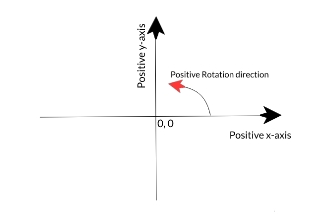
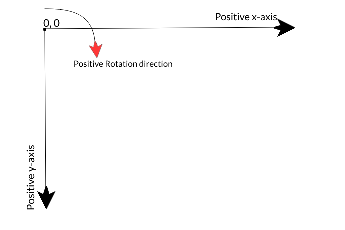
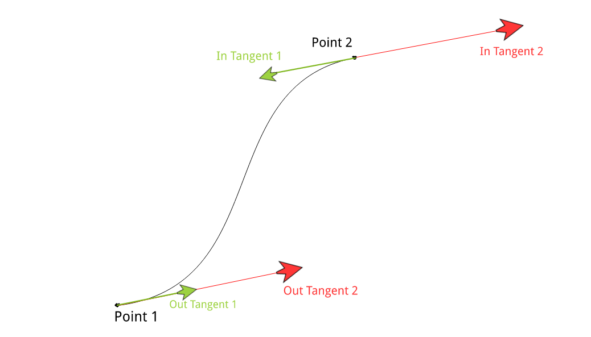

.. _miscellaneous:

Miscellaneous
=============

Synfig Coordinate System
------------------------

- Origin that is ``[0, 0]`` is placed in the center of the canvas. Positive x-axis is towards the right of origin and positive y-axis is towards the upside of origin as demonstrated in the figure.

- Rotation is measured starting from positive x-axis towards the anti-clockwise direction.

Lottie Coordinate System
------------------------

- Origin that is ``[0, 0]`` is placed at the upper left corner of the canvas. Positive x-axis is towards the right of origin and positive y-axis is towards the downside of origin as demonstrated in the figure.

- Rotation is measured starting from negative y-axis towards the clockwise direction.

Value of unit in pixels
-------------------------
1 u = :math:`\frac{image\ width\ in\ pixels}{image\ area\ width}` px

Origin conversion
-----------------

x_lottie = :math:`1u * x\_sif + \frac{image\ width\ in\ pixels}{2}`

y_lottie = :math:`-1u * y\_sif + \frac{image\ height\ in\ pixels}{2}`

Interpolation conversion
------------------------

- Green Tangents: Lottie format tangents

- Red Tangents  : Synfig format tangents

- Internally the interpolations are calculated using Bezier curves by Synfig.

- In Tangents for the formats differ in direction. They are exactly opposite of each other.

- Length of tangents differ by a multiple ``TANGENT_FACTOR``, which is a constant.

Unit conversion
---------------

- Opacity, referred to as amount:
  ``Amount(lottie) = Amount(.sif) * 100``

- ``angle_lottie = (90 - angle_sif) % 360 + shift*360``

  where ``shift = -[theta / 360]``
