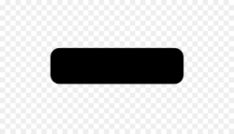

.. _supported:

Supported Features
==================

Star Layer
----------
+-----------------+---------------------+---------------------------------------------+
|  Property Name  |        Value        | Type(Animation)                             |
+=================+=====================+=============================================+
|     Z depth     |        |tick|       | |cross|                                     |
+-----------------+---------------------+---------------------------------------------+
|      Amount     |        |tick|       | |tick|                                      |
+-----------------+---------------------+---------------------------------------------+
|   Blend_method  | Partially supported | |minus|                                     |
+-----------------+---------------------+---------------------------------------------+
|      Color      |        |tick|       | TCB and Clamped interpolation not supported |
+-----------------+---------------------+---------------------------------------------+
|      Origin     |        |tick|       | |tick|                                      |
+-----------------+---------------------+---------------------------------------------+
|      Invert     |        |tick|       | |cross|                                     |
+-----------------+---------------------+---------------------------------------------+
|   Antialiasing  |        |tick|       | |tick|                                      |
+-----------------+---------------------+---------------------------------------------+
|     Feather     |        |cross|      | |cross|                                     |
+-----------------+---------------------+---------------------------------------------+
| Type of Feather |        |cross|      | |cross|                                     |
+-----------------+---------------------+---------------------------------------------+
|  Winding Style  |        |cross|      | |cross|                                     |
+-----------------+---------------------+---------------------------------------------+
|   Outer Radius  |        |tick|       | |tick|                                      |
+-----------------+---------------------+---------------------------------------------+
|   Inner Radius  |        |tick|       | |tick|                                      |
+-----------------+---------------------+---------------------------------------------+
|      Angle      |        |tick|       | |tick|                                      |
+-----------------+---------------------+---------------------------------------------+
|      Points     |        |tick|       | |tick|                                      |
+-----------------+---------------------+---------------------------------------------+
| Regular Polygon |        |tick|       | |tick|                                      |
+-----------------+---------------------+---------------------------------------------+

Circle Layer
------------
+---------------+---------------------+---------------------------------------------+
| Property Name |        Value        |               Type(Animation)               |
+===============+=====================+=============================================+
|    Z depth    |        |tick|       |                  |cross|                    |
+---------------+---------------------+---------------------------------------------+
|     Amount    |        |tick|       |                  |tick|                     |
+---------------+---------------------+---------------------------------------------+
|  Blend_method | Partially supported |                  |minus|                    |
+---------------+---------------------+---------------------------------------------+
|     Color     |        |tick|       | TCB and Clamped interpolation not supported |
+---------------+---------------------+---------------------------------------------+
|     Radius    |        |tick|       |                  |tick|                     |
+---------------+---------------------+---------------------------------------------+
|     Origin    |        |tick|       |                  |tick|                     |
+---------------+---------------------+---------------------------------------------+
|     Invert    |        |tick|       |                  |cross|                    |
+---------------+---------------------+---------------------------------------------+
|    Feather    |        |cross|      |                  |cross|                    |
+---------------+---------------------+---------------------------------------------+

Rectangle Layer
---------------
+---------------------+---------------------+---------------------------------------------+
|       Property      |        Value        |               Type(Animation)               |
+=====================+=====================+=============================================+
|       Z depth       |        |tick|       |                  |cross|                    |
+---------------------+---------------------+---------------------------------------------+
|        Amount       |        |tick|       |                  |tick|                     |
+---------------------+---------------------+---------------------------------------------+
|     Blend_method    | Partially supported |                  |minus|                    |
+---------------------+---------------------+---------------------------------------------+
|        Color        |        |tick|       | TCB and Clamped interpolation not supported |
+---------------------+---------------------+---------------------------------------------+
|       Point 1       |        |tick|       |                  |tick|                     |
+---------------------+---------------------+---------------------------------------------+
|       Point 2       |        |tick|       |                  |tick|                     |
+---------------------+---------------------+---------------------------------------------+
|        Expand       |        |tick|       |                  |tick|                     |
+---------------------+---------------------+---------------------------------------------+
|        Invert       |        |tick|       |                  |cross|                    |
+---------------------+---------------------+---------------------------------------------+
|      Feather X      |        |cross|      |                  |cross|                    |
+---------------------+---------------------+---------------------------------------------+
|      Feather Y      |        |cross|      |                  |cross|                    |
+---------------------+---------------------+---------------------------------------------+
|        Bevel        |        |tick|       |                  |tick|                     |
+---------------------+---------------------+---------------------------------------------+
| Keep Bevel Circular |        |tick|       |                  |tick|                     |
+---------------------+---------------------+---------------------------------------------+

Simple Circle Layer
-------------------
+---------------+---------------------+---------------------------------------------+
| Property Name |        Value        |               Type(Animation)               |
+===============+=====================+=============================================+
|    Z depth    |        |tick|       |                  |cross|                    |
+---------------+---------------------+---------------------------------------------+
|     Amount    |        |tick|       |                  |tick|                     |
+---------------+---------------------+---------------------------------------------+
|  Blend_method | Partially supported |                  |minus|                    |
+---------------+---------------------+---------------------------------------------+
|     Color     |        |tick|       | TCB and Clamped interpolation not supported |
+---------------+---------------------+---------------------------------------------+
|     Radius    |        |tick|       |                  |tick|                     |
+---------------+---------------------+---------------------------------------------+
|     Center    |        |tick|       |                  |tick|                     |
+---------------+---------------------+---------------------------------------------+

Solid Color Layer
-----------------
+--------------+---------------------+---------------------------------------------+
|   Property   |        Value        |               Type(Animation)               |
+==============+=====================+=============================================+
|    Z depth   |        |tick|       |                  |cross|                    |
+--------------+---------------------+---------------------------------------------+
|    Amount    |        |tick|       |                  |tick|                     |
+--------------+---------------------+---------------------------------------------+
| Blend_method | Partially supported |                  |minus|                    |
+--------------+---------------------+---------------------------------------------+
|     Color    |        |tick|       | TCB and Clamped interpolation not supported |
+--------------+---------------------+---------------------------------------------+

Import Image Layer
------------------

+------------------+--------------------------+--------------------------+
|     Property     |           Value          |      Type(Animation)     |
+==================+==========================+==========================+
|      Z depth     |           |tick|         |         |cross|          |
+------------------+--------------------------+--------------------------+
|      Amount      |           |tick|         |         |tick|           |
+------------------+--------------------------+--------------------------+
|   Blend_method   |    Partially supported   |         |minus|          |
+------------------+--------------------------+--------------------------+
|     Top Left     |           |tick|         |         |tick|           |
+------------------+--------------------------+--------------------------+
|   Bottom Right   |           |tick|         |         |tick|           |
+------------------+--------------------------+--------------------------+
|   Interpolation  |           |cross|        |         |cross|          |
+------------------+--------------------------+--------------------------+
| Gamma Adjustment |           |cross|        |         |cross|          |
+------------------+--------------------------+--------------------------+
|     Filename     | .lst files not supported | .lst files not supported |
+------------------+--------------------------+--------------------------+
|    Time Offset   |           |cross|        |         |cross|          |
+------------------+--------------------------+--------------------------+

Region Layer
-------------

+-----------------+---------------------+---------------------------------------------+
|     Property    |        Value        |               Type(Animation)               |
+=================+=====================+=============================================+
|     Z depth     |        |tick|       |                   |cross|                   |
+-----------------+---------------------+---------------------------------------------+
|      Amount     |        |tick|       |                    |tick|                   |
+-----------------+---------------------+---------------------------------------------+
|   Blend_method  | Partially supported |                   |minus|                   |
+-----------------+---------------------+---------------------------------------------+
|      Color      |        |tick|       | TCB and Clamped interpolation not supported |
+-----------------+---------------------+---------------------------------------------+
|      Origin     |        |tick|       |                    |tick|                   |
+-----------------+---------------------+---------------------------------------------+
|      Invert     |        |tick|       |                   |cross|                   |
+-----------------+---------------------+---------------------------------------------+
|   Antialiasing  |        |tick|       |                    |tick|                   |
+-----------------+---------------------+---------------------------------------------+
|     Feather     |       |cross|       |                   |cross|                   |
+-----------------+---------------------+---------------------------------------------+
| Type of Feather |       |cross|       |                   |cross|                   |
+-----------------+---------------------+---------------------------------------------+
|  Winding Style  |       |cross|       |                   |cross|                   |
+-----------------+---------------------+---------------------------------------------+
|     Vertices    |        |tick|       |                    |tick|                   |
+-----------------+---------------------+---------------------------------------------+

- Animation of `Addition/Deletion` of vertices is not yet supported

Polygon Layer
-------------

+-----------------+---------------------+---------------------------------------------+
|     Property    |        Value        |               Type(Animation)               |
+=================+=====================+=============================================+
|     Z depth     |        |tick|       |                  |cross|                    |
+-----------------+---------------------+---------------------------------------------+
|      Amount     |        |tick|       |                  |tick|                     |
+-----------------+---------------------+---------------------------------------------+
|   Blend_method  | Partially supported |                  |minus|                    |
+-----------------+---------------------+---------------------------------------------+
|      Color      |        |tick|       | TCB and Clamped interpolation not supported |
+-----------------+---------------------+---------------------------------------------+
|      Origin     |        |tick|       |                  |tick|                     |
+-----------------+---------------------+---------------------------------------------+
|      Invert     |        |tick|       |                  |cross|                    |
+-----------------+---------------------+---------------------------------------------+
|   Antialiasing  |        |tick|       |                  |tick|                     |
+-----------------+---------------------+---------------------------------------------+
|     Feather     |        |cross|      |                  |cross|                    |
+-----------------+---------------------+---------------------------------------------+
| Type of Feather |        |cross|      |                  |cross|                    |
+-----------------+---------------------+---------------------------------------------+
|  Winding Style  |        |cross|      |                  |cross|                    |
+-----------------+---------------------+---------------------------------------------+
|  Vertices List  |        |tick|       |             Partially Supported             |
+-----------------+---------------------+---------------------------------------------+

- Animation of `Addition/Deletion` of vertices in `Vertices List` is not yet supported

Outline Layer
-------------

+-----------------+---------------------+---------------------------------------------+
|     Property    |        Value        |               Type(Animation)               |
+-----------------+---------------------+---------------------------------------------+
|     Z depth     |        |tick|       |                   |cross|                   |
+-----------------+---------------------+---------------------------------------------+
|      Amount     |        |tick|       |                    |tick|                   |
+-----------------+---------------------+---------------------------------------------+
|   Blend_method  | Partially supported |                   |minus|                   |
+-----------------+---------------------+---------------------------------------------+
|      Color      |        |tick|       | TCB and Clamped interpolation not supported |
+-----------------+---------------------+---------------------------------------------+
|      Origin     |        |tick|       |                    |tick|                   |
+-----------------+---------------------+---------------------------------------------+
|      Invert     |        |tick|       |                   |cross|                   |
+-----------------+---------------------+---------------------------------------------+
|   Antialiasing  |        |tick|       |                    |tick|                   |
+-----------------+---------------------+---------------------------------------------+
|     Feather     |       |cross|       |                   |cross|                   |
+-----------------+---------------------+---------------------------------------------+
| Type of Feather |       |cross|       |                   |cross|                   |
+-----------------+---------------------+---------------------------------------------+
|  Winding Style  |       |cross|       |                   |cross|                   |
+-----------------+---------------------+---------------------------------------------+
|     Vertices    |        |tick|       |                    |tick|                   |
+-----------------+---------------------+---------------------------------------------+
|  Outline width  |        |tick|       |                    |tick|                   |
+-----------------+---------------------+---------------------------------------------+
|      Expand     |        |tick|       |                    |tick|                   |
+-----------------+---------------------+---------------------------------------------+
|   Sharp cusps   |        |tick|       |                    |tick|                   |
+-----------------+---------------------+---------------------------------------------+
|  Rounded Begin  |        |tick|       |                    |tick|                   |
+-----------------+---------------------+---------------------------------------------+
|   Rounded End   |        |tick|       |                    |tick|                   |
+-----------------+---------------------+---------------------------------------------+
|    Loopyness    |     Not required    |                 Not required                |
+-----------------+---------------------+---------------------------------------------+
|   Homogeneous   |        |tick|       |                    |tick|                   |
+-----------------+---------------------+---------------------------------------------+

- Animation of `Addition/Deletion` of vertices is not yet supported

Blend Methods
-------------
- The blend methods supported are: Composite, Difference, Multiply, Hard light, Luminance, Saturation, Hue, Color, Darken, Brighten, Overlay, Screen.
- These methods have somewhat different implementations in Lottie and Synfig, hence the blend methods tend to show different behaviour when a layer is blended over a transparent background.
